  <strong>I like building things for the web and putting them online. These days a lot of it involves AI.</strong>

  <code>🌐 Web dev</code>
  <code>🤖 AI projects</code>
  <code>🛠️ Side projects</code>

  
  
  
  

<table>
<tr>
<td valign="top" width="50%">

#### 🧭 What I Work On

Mostly web apps with Next.js and Node. Lately a lot of AI stuff too: RAG apps, a browser copilot, and tooling that tests what AI agents build.

Sometimes I wander off into hardware and computer vision, like controlling my screen with hand gestures.

#### 🔨 Right Now

- Building side projects and putting them live on Vercel
- Contributing to verfix in my spare time
- Solving NeetCode problems in C++

</td>
<td valign="top" width="48%">

#### 💻 Things I've Built

- **[XBlog](https://github.com/jyotir-aditya/XBlog)** · [live](https://x-blog-sable.vercel.app)
   A blogging platform. Sign up, write posts, and follow other writers.
- **[verfix](https://github.com/verfix-dev/verfix)**
   A CLI that checks whether an AI-built web app actually works, and explains why when it doesn't.
- **[gestureFlow](https://github.com/jyotir-aditya/gestureFlow)**
   Scroll and switch apps by waving at your webcam. Python, MediaPipe, OpenCV.
- **[copilot-backend](https://github.com/jyotir-aditya/copilot-backend)**
   Backend for an AI browser assistant that remembers context and can do tasks for you. Runs on Cloudflare Workers.
- **[rag-youtube](https://github.com/jyotir-aditya/rag-youtube)**
   Paste a YouTube link and ask questions about the video.
- **[smart-environment-control-system](https://github.com/jyotir-aditya/smart-environment-control-system)** · [live](https://smart-environment-control-system.vercel.app)
   College IoT project: a dashboard that reads room sensors and moves a servo remotely.

</td>
</tr>
</table>

#### 🧰 Stack

#### 📈 Signals

 

